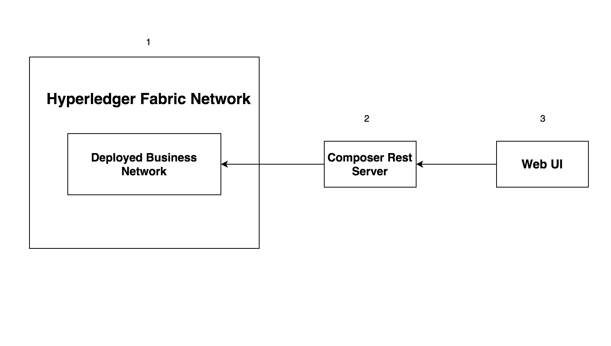

# Hyperledger Composer - 包含事件的产品拍卖网络

*阅读本文的其他语言版本：[English](README.md)。*

欢迎学习 Hyperledger Composer Composite Pattern 的第 3 部分。这是 [Hyperledger Composer - 产品拍卖网络](https://github.com/IBM/BlockchainSmartContractTrading-CompositeJourney) 的延续。本 code pattern 将展示如何通过 Hyperledger Composer 发出事件，并通过外部应用程序订阅事件。

## 包含的组件

* Hyperledger Fabric
* Hyperledger Composer
* Docker

## 应用程序工作流图



* 启动 Hyperledger Fabric 网络
* 生成并部署 Business Network Archive
* 启动 composer rest 服务器并连接到已部署的业务网络
* 启动 Web 应用程序

## 步骤

1. [生成 Business Network Archive (BNA)](#1-generate-the-business-network-archive-bna)
2. [将 Business Network Archive 部署到在本地运行的 Hyperledger Composer 上](#2-deploy-the-business-network-archive-on-hyperledger-composer-running-locally)
3. [启动 Web UI](#3-start-the-web-ui)
4. [执行事务](#perform-the-transactions)

## 1.生成 Business Network Archive (BNA)

请安装 [Hyperledger Composer Development Tools](https://github.com/IBM/BlockchainNetwork-CompositeJourney#1-installing-hyperledger-composer-development-tools)。

克隆该存储库：
```
git clone https://github.com/IBM/BlockchainEvents-CompositeJourney.git
```

要检查文件的结构是否有效，现在可以为您的业务网络定义生成一个 Business Network Archive (BNA) 文件。BNA 文件是可部署的单元 - 一个可部署到 Composer 运行时上执行的文件。

使用以下命令生成网络归档文件：
```bash
cd Composer
npm install
```
您会看到以下输出：
```bash
> mkdirp ./dist && composer archive create --sourceType dir --sourceName .-a ./dist/events.bna

Creating Business Network Archive


Looking for package.json of Business Network Definition
	Input directory: /Users/ishan/Documents/demo/BlockchainEvents-CompositeJourney/Composer

Found:
	Description: Sample product auction network with events
	Name: events
	Identifier: events@0.0.1

Written Business Network Definition Archive file to
	Output file: ./dist/events.bna

Command succeeded
```

`composer archive create` 命令在 `dist` 文件夹中创建了一个名为 `events.bna` 的文件。

可以针对一个嵌入式运行时来测试业务网络定义，该运行时在一个 Node.js 进程中将“区块链”的状态存储在内存中。
从您的项目工作目录，打开文件 test/productAuction.js 并运行以下命令：
```
npm test
```
您应该看到以下输出：
```
> events@0.0.1 test /Users/ishan/Documents/demo/BlockchainEvents-CompositeJourney/Composer
> mocha --recursive

  ProductAuction - AddProduct Test
    #BiddingProcess
      ✓ Add the product to seller list (154ms)
      ✓ Authorized owner should start the bidding (117ms)
      ✓ Members bid for the product (181ms)
      ✓ Close bid for the product (96ms)


  4 passing (2s)
```

## 2.将 Business Network Archive 部署到在本地运行的 Hyperledger Composer 上

请按照[操作说明](https://github.com/IBM/BlockchainNetwork-CompositeJourney#2-starting-hyperledger-fabric) 启动本地 Fabric。
现在将目录导航到包含 `product-auction.bna` 文件的 `dist` 文件夹并键入：
```
cd dist
composer runtime install --card PeerAdmin@hlfv1 --businessNetworkName events
composer network start --card PeerAdmin@hlfv1 --networkAdmin admin --networkAdminEnrollSecret adminpw --archiveFile events.bna --file networkadmin.card
composer card import --file networkadmin.card
```

可以键入以下命令来验证网络已部署：
```
composer network ping --card admin@events
```

您会看到以下输出：
```
The connection to the network was successfully tested: events
	version: 0.16.0
	participant: org.hyperledger.composer.system.NetworkAdmin#admin

Command succeeded
```

要创建 REST API，需要启动 `composer-rest-server`，告诉它如何连接到我们已部署的业务网络。
现在启动该服务器，方法是将目录更改为 product-auction 文件夹并键入以下内容：
```bash
cd ..
composer-rest-server
```

回答启动时提出的问题。这些信息使得 composer-rest-server 能连接到 Hyperledger Fabric，并配置如何生成 REST API。
* 输入 `admin@events` 作为卡名称。
* 在询问是否在生成的 API 中使用名称空间时，选择 `never use namespaces`。
* 在询问是否保护生成的 API 时，选择 `No`。
* 在询问是否启用事件发布时，选择 `Yes`。
* 在询问是否启用 TLS 安全性时，选择 `No`。

**测试 REST API**

如果 composer-rest-server 成功启动，您会看到以下两行输出：
```
Web server listening at: http://localhost:3000
Browse your REST API at http://localhost:3000/explorer
```

## 3. 启动 Web UI

在一个新终端窗口中，导航到 `Web` 目录并使用以下命令启动 Node 服务器：
```
npm install
node server.js
```

## 4. 执行事务

在拍卖网络中按照 [composer 部分](https://github.com/IBM/BlockchainSmartContractTrading-CompositeJourney#2-deploy-the-business-network-archive-using-composer-playground)中的操作说明执行事务。在用户执行 `publishListing`、`makeoffer` 和 `closeBidding` 事务时发出事件。从 Hyperledger Fabric 网络发出事件后，销售者和购买者的 Web UI 将会更新。

您可以使用在本地运行的 Composer REST API 或 Composer Playground 来提交事务。

### 使用 Composer REST API 提交事务

打开 Web 浏览器并导航到 http://localhost:3000/explorer。

### 使用本地运行的 Composer Playground。

打开一个新终端并导航到 `BlockchainEvents` 目录。使用以下命令安装 Composer Playground：
```
npm i composer-playground@0.16.1
```

使用以下命令在本地运行 Composer Playground：
```
composer-playground
```

导航到 http://localhost:8000/seller.html、http://localhost:8000/buyer.html， 查看仪表板中的 Seller 和 Buyer 事件。

## 其他资源
* [Hyperledger Fabric 文档](http://hyperledger-fabric.readthedocs.io/en/latest/)
* [Hyperledger Composer 文档](https://hyperledger.github.io/composer/introduction/introduction.html)

## 许可
[Apache 2.0](LICENSE)
