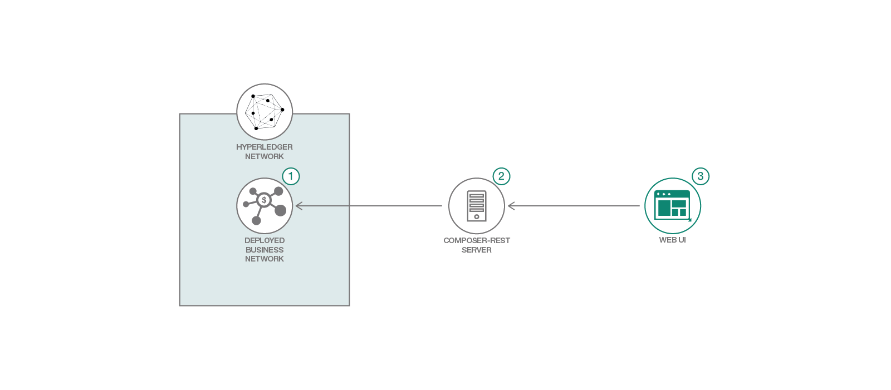

# Hyperledger Composer - イベントによる製品オークションネットワーク

*他の言語で読む: [English](README.md),[한국어](README-ko.md),[中国](README-cn.md)*

Hyperledger Composer Composite パターンのパート3へようこそ。
これは [Hyperledger Composer - Product Auction Network](https://github.com/IBM/BlockchainSmartContractTrading-CompositeJourney) の続きです。
このパターンは、イベントが Hyperledger Composer によってどのように送信され、外部アプリケーションによってサブスクライブされるかを示しています。

対象レベル: 中級の開発者

IBM Cloud Lite アカウントをお持ちの場合、このパターンを実行するために Starter Plan を30日間使用することもできます。

## 含まれるコンポーネント

* Hyperledger Fabric
* Hyperledger Composer
* Docker

## アプリケーションのワークフロー図



1. Hyperledger Fabric ネットワークを起動します。
2. ビジネス・ネットワーク・アーカイブを生成してデプロイします。
3. Hyperledger Composer REST サーバーを起動してデプロイ済みのビジネス・ネットワークに接続し、Web アプリケーションを起動します。

## 手順

1. [ビジネス・ネットワーク・アーカイブ (BNA) を生成する](#1-generate-the-business-network-archive-bna)
2. [ビジネス・ネットワーク・アーカイブを、ローカルで稼働中の Hyperledger Composer 上にデプロイする](#2-deploy-the-business-network-archive-on-hyperledger-fabric-running-locally)
3. [Web UI を起動する](#3-start-the-web-ui)
4. [トランザクションを実行し、イベントを送信して処理する](#4-submit-transactions)

<a name="1-generate-the-business-network-archive-bna"></a>
## 1. ビジネス・ネットワーク・アーカイブ (BNA) を生成する

[Hyperledger Composer](https://hyperledger.github.io/composer/latest/installing/installing-prereqs) の前提条件がインストールされていることを確認してください。
また、 [手順](https://hyperledger.github.io/composer/latest/installing/development-tools) を参照して、Hyperledger Composer、Hyperledger Fabric およびその他のノードモジュールを含む開発環境をインストールしていることを確認してください。
これらの手順は、次のことを含んでいます:

- npm を使用して Hyperledger Composer と 関連するノードモジュールをインストールします。
- Hyperledger Fabric のための Docker イメージをダウンロードします。
- あなたのマシン上でローカルに Hyperledger Fabric を起動します。
- `createPeerAdminCard.sh` を実行して、この演習の後半でビジネスネットワークをインストールするために使用するネットワークカードを作成します。

リポジトリをクローンします:

```
$ git clone https://github.com/IBM/BlockchainEvents-CompositeJourney.git
```

ファイル構造が有効であることを確認するために、あなたのビジネスネットワーク定義のための Business Network Archive (BNA) ファイルを生成できます。 `.bna` ファイルはデプロイ可能なユニットで、実行のために Hyperledger Composer ランタイムにデプロイできるファイルです。

ネットワークアーカイブを生成するには、次のコマンドを使用します:

```
$ cd BlockchainEvents-CompositeJourney/Composer
$ npm install
```

次の出力が表示されます:

```
$ mkdirp ./dist && composer archive create --sourceType dir --sourceName . -a ./dist/events.bna

Creating Business Network Archive


Looking for package.json of Business Network Definition
	Input directory: /Users/ishan/Documents/demo/BlockchainEvents-CompositeJourney/Composer

Found:
	Description: Sample product auction network with events
	Name: events
	Identifier: events@0.0.1

Written Business Network Definition Archive file to
	Output file: ./dist/events.bna

Command succeeded
```

`composer archive create` コマンドは `dist` フォルダに `events.bna` というファイルを作成します。

Node.js プロセス内に **ブロックチェーン** の状態を格納している組み込みランタイムに対して、ビジネスネットワーク定義をテストできます。プロジェクトの作業ディレクトリから `test/productAuction.js` ファイルを開き、次のコマンドを実行します:

```
$ npm test
```

次の出力が表示されます:

```
> events@0.0.1 test /Users/ishan/Documents/demo/BlockchainEvents-CompositeJourney/Composer
> nyc mocha -t 0 test/*.js


  #org.acme.product.auction
    ✓ Authorized owner should start the bidding (74ms)
    ✓ Members bid for the product (139ms)
    ✓ Close bid for the product (175ms)


  3 passing (2s)

----------|----------|----------|----------|----------|-------------------|
File      |  % Stmts | % Branch |  % Funcs |  % Lines | Uncovered Line #s |
----------|----------|----------|----------|----------|-------------------|
All files |        0 |        0 |        0 |        0 |                   |
----------|----------|----------|----------|----------|-------------------|
```

<a name="2-deploy-the-business-network-archive-on-hyperledger-fabric-running-locally"></a>
## 2. ビジネス・ネットワーク・アーカイブを、ローカルで稼働中の Hyperledger Composer 上にデプロイする

[手順](https://hyperledger.github.io/composer/latest/installing/development-tools) を参照して、マシン上に Hyperledger Fabric インスタンスがローカルに起動していることを確認してください。
ディレクトリを `events.bna` ファイルを含む `dist` フォルダに変更し、次のコマンドを実行してローカル Hyperbelger ファブリックインスタンスにビジネスネットワークをインストール、展開して起動します:

```
$ cd BlockchainEvents-CompositeJourney/Composer/dist
$ composer network install -c PeerAdmin@hlfv1 -a events.bna
$ composer network start -c PeerAdmin@hlfv1 -n events -V 0.0.1 -A admin -S adminpw -f networkadmin.card
$ composer card import --file networkadmin.card
```

次のように入力して、ネットワークが展開されたことを確認できます:

```
$ composer network ping --card admin@events
```

次の出力が表示されます:

```
The connection to the network was successfully tested: events
The connection to the network was successfully tested: events
	Business network version: 0.0.1
	Composer runtime version: 0.19.5
	participant: org.hyperledger.composer.system.NetworkAdmin#admin
	identity:org.hyperledger.composer.system.Identity#e7eaa3bc255f5ded89fd5c25748aca87959c9b3fc6ad6a94c65d679162db84fd
Command succeeded
```

REST APIを作成するには、`composer-rest-server` を起動し、展開されたビジネスネットワークに接続する方法を指定してください。次に、ディレクトリを product-auction フォルダに変更し、次のように入力してサーバーを起動します:

```
$ cd BlockchainEvents-CompositeJourney/Composer
$ composer-rest-server

? Enter the name of the business network card to use: admin@events
? Specify if you want namespaces in the generated REST API: never use namespaces
? Specify if you want to use an API key to secure the REST API: No
? Specify if you want to enable authentication for the REST API using Passport: No
? Specify if you want to enable event publication over WebSockets: Yes
? Specify if you want to enable TLS security for the REST API: No
```

### REST API をテストする

`composer-rest-server` が正常に起動した場合、次の2つの行が出力されるはずです:

```
Web server listening at: http://localhost:3000
Browse your REST API at http://localhost:3000/explorer
```

<a name="3-start-the-web-ui"></a>
## 3. Web UI を起動する

新しい端末ウィンドウで、`Web` ディレクトリに移動し、次のコマンドを使用してノードサーバを起動します:

```
cd BlockchainEvents-CompositeJourney/Web
$ npm install
$ node server.js
```

<a name="4-submit-transactions"></a>
## 4. トランザクションを実行し、イベントを送信して処理する

[Hyperledger Composer Section](https://github.com/IBM/BlockchainSmartContractTrading-CompositeJourney#2-deploy-the-business-network-archive-using-composer-playground) の手順に従って、オークションネットワークへのトランザクションを送信してください。イベントは、ユーザーが `publishListing`、`makeoffer`、`closeBidding` トランザクションを送信すると生成されます。Hyperledger Fabric ネットワークから送信されたイベントで、売り手と買い手のための Web UI が更新されます。

ローカルで実行中の Hyperledger Composer REST API または Hyperledger Composer Playground を使用してトランザクションを送信できます。

### REST API を使用する

Web ブラウザを開き、`http://localhost:3000/explorer` にアクセスします。

### Composer Playground を使用する

以下のコマンドで、Hyperledger Composer Playground をローカルにインストールできます:

```
$ npm install -g composer-playground
```

そして、Hyperledger Composer Playground をローカルで実行するには:
```
$ composer-playground
```

売り手と買い手のイベントのためのダッシュボードを表示するには、`http://localhost:8000/seller.html` と `http://localhost:8000/buyer.html` に移動します。

## 参考資料

* [Hyperledger Fabric Docs](https://hyperledger-fabric.readthedocs.io/)
* [Hyperledger Composer Docs](https://hyperledger.github.io/composer/latest/introduction/introduction.html)

## ライセンス
[Apache 2.0](LICENSE)
