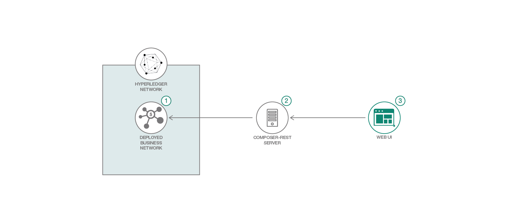

# Hyperledger Composer - Product Auction Network With Events

*Read this in other languages: [한국어](README-ko.md),[中国](README-cn.md),[日本](README-ja.md)*

# WARNING: This repository is no longer maintained :warning:

> This repository, which contains assets to run a Hyperledger Composer application, is not being actively maintained due to a shift to focus on Hyperledger Fabric. This repository will not be updated. The repository will be kept available in read-only mode. Refer to https://github.com/IBM/auction-events for a similar example.

Welcome to Part 3 of the Hyperledger Composer Composite Pattern. This is a continuation of [Hyperledger Composer - Product Auction Network](https://github.com/IBM/BlockchainSmartContractTrading-CompositeJourney). This pattern shows how events can be emitted by Hyperledger Composer and subscribed by external applications.

Audience level : Intermediate Developers

If you have an IBM Cloud Lite account, you can also use the Starter Plan for 30 days to do this pattern.

## Included Components

* Hyperledger Fabric
* Hyperledger Composer
* Docker

## Application Workflow Diagram



* Start the Hyperledger Fabric Network
* Generate and Deploy the Business Network Archive
* Start and connect the composer rest server to deployed business network
* Start the Web Application

## Steps

1. [Generate the Business Network Archive (BNA)](#1-generate-the-business-network-archive-bna)
2. [Deploy the Business Network Archive to Local Hyperledger Fabric instance](#2-deploy-the-business-network-archive-on-hyperledger-fabric-running-locally)
3. [Start the Web UI](#3-start-the-web-ui)
4. [Submit Transactions](#4-submit-transactions)

## 1. Generate the Business Network Archive (BNA)

Make sure that you have installed the prerequisites for [Hyperledger Composer](https://hyperledger.github.io/composer/latest/installing/installing-prereqs).
Also, make sure that you have installed the development environment which
includes Hyperledger Composer, Hyperledger Fabric and the other node modules using these
[instructions](https://hyperledger.github.io/composer/latest/installing/development-tools).
As a recap for those instructions, you should have done the following:

- Installed Hyperledger Composer and it's related Node modules using `npm`.
- Downloaded the docker images for Hyperledger Fabric.
- Started Hyperledger Fabric locally on your machine.
- Executed `createPeerAdminCard.sh` to create a network card that will be used to
install the business network later in this exercise.


Clone the repository:

```
$ git clone https://github.com/IBM/BlockchainEvents-CompositeJourney
```

To check that the structure of the files is valid, you can now generate a
Business Network Archive (BNA) file for your business network definition. The
`.bna` file is the deployable unit -- a file that can be deployed to the
Hyperledger Composer runtime for execution.

Use the following command to generate the network archive:

```
$ cd BlockchainEvents-CompositeJourney/Composer
$ npm install
```

You should see the following output:

```
$ mkdirp ./dist && composer archive create --sourceType dir --sourceName . -a ./dist/events.bna

Creating Business Network Archive


Looking for package.json of Business Network Definition
	Input directory: /Users/ishan/Documents/demo/BlockchainEvents-CompositeJourney/Composer

Found:
	Description: Sample product auction network with events
	Name: events
	Identifier: events@0.0.1

Written Business Network Definition Archive file to
	Output file: ./dist/events.bna

Command succeeded
```

The `composer archive create` command has created a file called `events.bna` in
the `dist` folder.

You can test the business network definition against the embedded runtime that
stores the state of 'the blockchain' in-memory in a Node.js process. From your
project working directory, open the file test/productAuction.js and run the
following command:

```
$ npm test
```

You should see the following output :

```
> events@0.0.1 test /Users/ishan/Documents/demo/BlockchainEvents-CompositeJourney/Composer
> nyc mocha -t 0 test/*.js


  #org.acme.product.auction
    ✓ Authorized owner should start the bidding (74ms)
    ✓ Members bid for the product (139ms)
    ✓ Close bid for the product (175ms)


  3 passing (2s)

----------|----------|----------|----------|----------|-------------------|
File      |  % Stmts | % Branch |  % Funcs |  % Lines | Uncovered Line #s |
----------|----------|----------|----------|----------|-------------------|
All files |        0 |        0 |        0 |        0 |                   |
----------|----------|----------|----------|----------|-------------------|
```

## 2. Deploy the Business Network Archive to Local Hyperledger Fabric instance

Make sure that you have started Hyperledger Fabric instance locally on your machine
using these [instructions](https://hyperledger.github.io/composer/latest/installing/development-tools).
Now change directory to the `dist` folder containing `events.bna` file and execute
the following commands to install/deploy and start the business network on the
local Hyperledger Fabric instance:

```
$ cd BlockchainEvents-CompositeJourney/Composer/dist
$ composer network install -c PeerAdmin@hlfv1 -a events.bna
$ composer network start -c PeerAdmin@hlfv1 -n events -V 0.0.1 -A admin -S adminpw -f networkadmin.card
$ composer card import --file networkadmin.card
```

You can verify that the network has been deployed by typing:

```
$ composer network ping --card admin@events
```

You should see the the output as follows:

```
The connection to the network was successfully tested: events
The connection to the network was successfully tested: events
	Business network version: 0.0.1
	Composer runtime version: 0.19.5
	participant: org.hyperledger.composer.system.NetworkAdmin#admin
	identity:org.hyperledger.composer.system.Identity#e7eaa3bc255f5ded89fd5c25748aca87959c9b3fc6ad6a94c65d679162db84fd
Command succeeded
```

To create the REST API we need to launch the `composer-rest-server` and tell it how to connect to our deployed business network. Now launch the server by changing directory to the product-auction folder and type:

```
$ cd BlockchainEvents-CompositeJourney/Composer
$ composer-rest-server

? Enter the name of the business network card to use: admin@events
? Specify if you want namespaces in the generated REST API: never use namespaces
? Specify if you want to use an API key to secure the REST API: No
? Specify if you want to enable authentication for the REST API using Passport: No
? Specify if you want to enable event publication over WebSockets: Yes
? Specify if you want to enable TLS security for the REST API: No
```

**Test REST API**

If the `composer-rest-server` started successfully you should see these two lines are output:

```
Web server listening at: http://localhost:3000
Browse your REST API at http://localhost:3000/explorer
```

## 3. Start the Web UI

In a new terminal window, navigate to `Web` directory and launch the node server using command:

```
cd BlockchainEvents-CompositeJourney/Web
$ npm install
$ node server.js
```

## 4. Submit Transactions

Submit transactions for auction network using the instructions in [Hyperledger Composer Section](https://github.com/IBM/BlockchainSmartContractTrading-CompositeJourney#2-deploy-the-business-network-archive-using-composer-playground). Events are emitted when user submits `publishListing`,
`makeoffer` and `closeBidding` transactions. Web UI for seller and buyer updates
on the event emitted from the Hyperledger Fabric network.

You can submit the transactions either by using Hyperledger Composer REST API or
Hyperledger Composer Playground running locally.

### Using REST API

Open a web browser and navigate to `http://localhost:3000/explorer`.

### Using Composer Playground

You can Install the Hyperledger Composer Playground locally as shown below:

```
$ npm install -g composer-playground
```

And, run the Hyperledger Composer Playground locally using:
```
$ composer-playground
```

Navigate to `http://localhost:8000/seller.html` and `http://localhost:8000/buyer.html`
to view the dashboards for Seller and Buyer events.

## Additional Resources
* [Hyperledger Fabric Docs](https://hyperledger-fabric.readthedocs.io/)
* [Hyperledger Composer Docs](https://hyperledger.github.io/composer/latest/introduction/introduction.html)

## License
This code pattern is licensed under the Apache Software License, Version 2.  Separate third party code objects invoked within this code pattern are licensed by their respective providers pursuant to their own separate licenses. Contributions are subject to the [Developer Certificate of Origin, Version 1.1 (DCO)](https://developercertificate.org/) and the [Apache Software License, Version 2](https://www.apache.org/licenses/LICENSE-2.0.txt).

[Apache Software License (ASL) FAQ](https://www.apache.org/foundation/license-faq.html#WhatDoesItMEAN)
