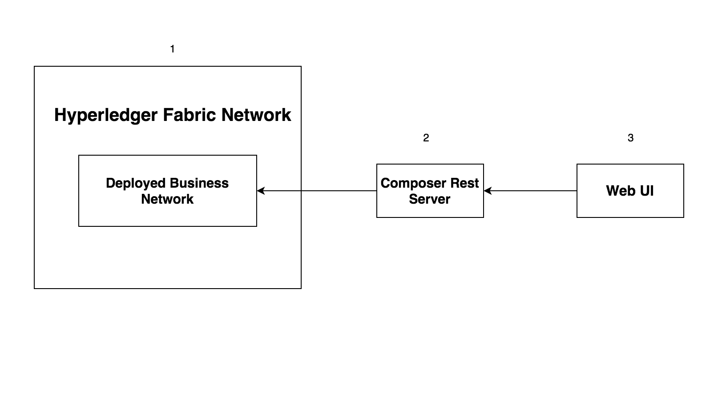

# Hyperledger Composer - Product Auction Network With Events

*Read this in other languages: [한국어](README-ko.md),[中国](README-cn.md)*

Welcome to Part 3 of the Hyperledger Composer Composite Pattern. This is a continuation of [Hyperledger Composer - Product Auction Network](https://github.com/IBM/BlockchainSmartContractTrading-CompositeJourney). This pattern shows how events can be emitted by Hyperledger Composer and subscribed by external applications.

## Included Components

* Hyperledger Fabric
* Hyperledger Composer
* Docker

## Application Workflow Diagram



* Start the Hyperledger Fabric Network
* Generate and Deploy the Business Network Archive
* Start and connect the composer rest server to deployed business network
* Start the Web Application

## Steps

1. [Generate the Business Network Archive (BNA)](#1-generate-the-business-network-archive-bna)
2. [Deploy the Business Network Archive on Hyperledger Composer running locally](#2-deploy-the-business-network-archive-on-hyperledger-composer-running-locally)
3. [Start the Web UI](#3-start-the-web-ui)
4. [Perform the transactions](#perform-the-transactions)

## 1. Generate the Business Network Archive (BNA)

Please install the [Hyperledger Composer Development Tools](https://github.com/IBM/BlockchainNetwork-CompositeJourney#1-installing-hyperledger-composer-development-tools).

Clone the repository:
```
git clone https://github.com/IBM/BlockchainEvents-CompositeJourney.git
```

To check that the structure of the files is valid, you can now generate a Business Network Archive (BNA) file for your business network definition. The BNA file is the deployable unit -- a file that can be deployed to the Composer runtime for execution.

Use the following command to generate the network archive:
```bash
cd Composer
npm install
```
You should see the following output:
```bash
> mkdirp ./dist && composer archive create --sourceType dir --sourceName . -a ./dist/events.bna

Creating Business Network Archive


Looking for package.json of Business Network Definition
	Input directory: /Users/ishan/Documents/demo/BlockchainEvents-CompositeJourney/Composer

Found:
	Description: Sample product auction network with events
	Name: events
	Identifier: events@0.0.1

Written Business Network Definition Archive file to
	Output file: ./dist/events.bna

Command succeeded
```

The `composer archive create` command has created a file called `events.bna` in the `dist` folder.

You can test the business network definition against the embedded runtime that stores the state of 'the blockchain' in-memory in a Node.js process.
From your project working directory, open the file test/productAuction.js and run the following command:
```
npm test
```
You should see the following output :
```
> events@0.0.1 test /Users/ishan/Documents/demo/BlockchainEvents-CompositeJourney/Composer
> mocha --recursive

  ProductAuction - AddProduct Test
    #BiddingProcess
      ✓ Add the product to seller list (154ms)
      ✓ Authorized owner should start the bidding (117ms)
      ✓ Members bid for the product (181ms)
      ✓ Close bid for the product (96ms)


  4 passing (2s)
```

## 2. Deploy the Business Network Archive on Hyperledger Composer running locally

Please start the local Fabric using the [instructions](https://github.com/IBM/BlockchainNetwork-CompositeJourney#2-starting-hyperledger-fabric).
Now change directory to the `dist` folder containing `product-auction.bna` file and type:
```
cd dist
composer runtime install --card PeerAdmin@hlfv1 --businessNetworkName events
composer network start --card PeerAdmin@hlfv1 --networkAdmin admin --networkAdminEnrollSecret adminpw --archiveFile events.bna --file networkadmin.card
composer card import --file networkadmin.card
```

You can verify that the network has been deployed by typing:
```
composer network ping --card admin@events
```

You should see the the output as follows:
```
The connection to the network was successfully tested: events
	version: 0.16.0
	participant: org.hyperledger.composer.system.NetworkAdmin#admin

Command succeeded
```

To create the REST API we need to launch the `composer-rest-server` and tell it how to connect to our deployed business network.
Now launch the server by changing directory to the product-auction folder and type:
```bash
cd ..
composer-rest-server
```

Answer the questions posed at startup. These allow the composer-rest-server to connect to Hyperledger Fabric and configure how the REST API is generated.
* Enter `admin@events` as the card name.
* Select `never use namespaces` when asked whether to use namespaces in the generated API.
* Select `No` when asked whether to secure the generated API.
* Select `Yes` when asked whether to enable event publication.
* Select `No` when asked whether to enable TLS security.

**Test REST API**

If the composer-rest-server started successfully you should see these two lines are output:
```
Web server listening at: http://localhost:3000
Browse your REST API at http://localhost:3000/explorer
```

## 3.Start the Web UI

In a new terminal window, navigate to `Web` directory and launch the node server using command:
```
npm install
node server.js
```

In your web browser, navigate to http://localhost:8000/buyer.html to see the view of the buyer or http://localhost:8000/seller.html for the view of the seller. 

## 4.Perform the transactions

Perform the transactions in auction network using the instructions in [composer section](https://github.com/IBM/BlockchainSmartContractTrading-CompositeJourney#2-deploy-the-business-network-archive-using-composer-playground). Events are emitted when user perform `publishListing`, `makeoffer` and `closeBidding` transactions. Web UI for seller and buyer updates on the event emitted from the Hyperledger fabric network.

You can submit the transactions either by using Composer REST API or Composer Playground running locally.

### Using Composer REST API to submit the transactions

Open a web browser and navigate to  http://localhost:3000/explorer.

### Using Composer Playground running locally.

Open a new terminal and navigate to `BlockchainEvents` directory. Install the composer playground using:
```
npm i composer-playground@0.16.1
```

Run the composer playground locally using:
```
composer-playground
```

Navigate to http://localhost:8000/seller.html, http://localhost:8000/buyer.html to view the dashboards for Seller and Buyer events.

## Additional Resources
* [Hyperledger Fabric Docs](http://hyperledger-fabric.readthedocs.io/en/latest/)
* [Hyperledger Composer Docs](https://hyperledger.github.io/composer/introduction/introduction.html)

## License
[Apache 2.0](LICENSE)
